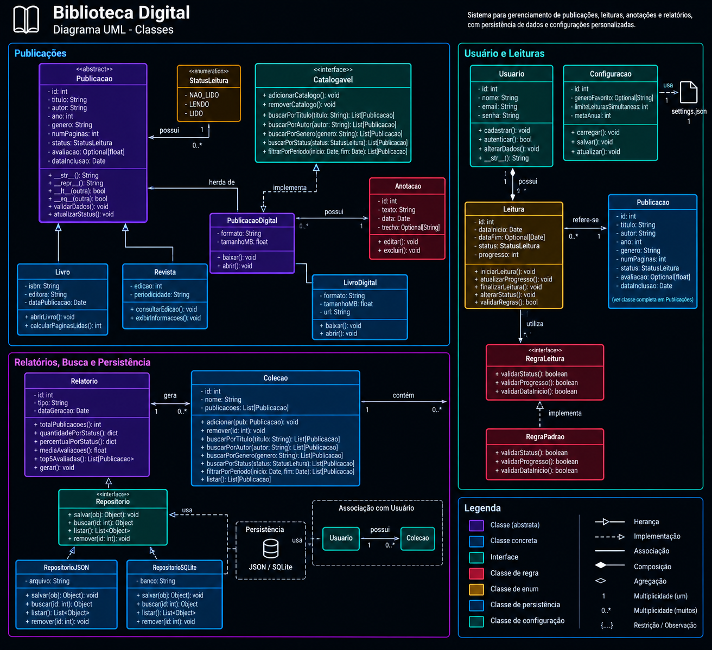

# Sistema de Biblioteca Pessoal/digital

## Descrição

Sistema para gerenciamento de uma biblioteca pessoal/digital, desenvolvido
utilizando os princípios de Programação Orientada a Objetos (POO).

O sistema permite o gerenciamento de publicações, leituras, anotações,
coleções, relatórios, regras de leitura e persistência dos dados.

## Objetivo

O projeto tem como objetivo permitir o gerenciamento de uma biblioteca
pessoal, possibilitando:

- Cadastro e gerenciamento de publicações;
- Organização de livros, revistas e publicações digitais;
- Registro e acompanhamento de leituras;
- Criação de anotações;
- Organização de publicações em coleções;
- Busca e filtragem de publicações;
- Geração de relatórios;
- Aplicação de regras de leitura;
- Persistência dos dados em diferentes formatos.

## Diagrama UML

Abaixo está o diagrama UML contendo as principais classes, interfaces,
enumerações, atributos, métodos e relacionamentos do sistema.



## Estrutura de Classes

### 📖 Publicações

As classes relacionadas às publicações são responsáveis por representar
os diferentes tipos de conteúdo disponíveis na biblioteca.

- `Publicacao`
- `Livro`
- `Revista`
- `PublicacaoDigital`
- `LivroDigital`
- `Anotacao`
- `Catalogavel`
- `StatusLeitura`

A classe `Publicacao` é uma classe abstrata que possui informações comuns
às publicações, como título, autor, ano, gênero, número de páginas,
status de leitura, avaliação e data de inclusão.

A classe `Livro` representa livros físicos, enquanto `Revista` representa
revistas e periódicos.

`PublicacaoDigital` representa publicações digitais e possui informações
específicas, como formato e tamanho do arquivo.

`LivroDigital` é uma especialização de `PublicacaoDigital`.

A interface `Catalogavel` define operações relacionadas à busca,
catalogação e filtragem das publicações.

`StatusLeitura` é uma enumeração utilizada para representar o estado
de leitura de uma publicação.

## 👤 Usuários e Leituras

As classes relacionadas aos usuários e ao acompanhamento das leituras
são:

- `Usuario`
- `Configuracao`
- `Leitura`
- `RegraLeitura`
- `RegraPadrao`

A classe `Usuario` representa o usuário do sistema e possui informações
como nome, e-mail e senha.

A classe `Configuracao` permite armazenar configurações personalizadas
do usuário, como gênero favorito, limite de leituras simultâneas e
meta anual.

A classe `Leitura` registra o acompanhamento de uma leitura, contendo
informações como data de início, data de fim, status e progresso.

A interface `RegraLeitura` define regras que podem ser utilizadas para
validar o status, progresso e data de uma leitura.

`RegraPadrao` implementa a interface `RegraLeitura`, fornecendo as
regras padrão do sistema.

### 📝 Anotações

A classe `Anotacao` permite que o usuário registre informações relacionadas
a uma publicação, armazenando:

- Texto;
- Data;
- Trecho opcional.

Também possui métodos para editar e excluir uma anotação.

## 📚 Coleções

A classe `Colecao` permite organizar publicações em grupos.

Ela possui informações como:

- `id`
- `nome`
- Lista de publicações

Também disponibiliza operações para:

- Adicionar publicações;
- Remover publicações;
- Buscar por título;
- Buscar por autor;
- Buscar por gênero;
- Buscar por status;
- Filtrar por período;
- Listar publicações.

Um usuário pode possuir várias coleções.

## 📊 Relatórios

A classe `Relatorio` é responsável pela geração de informações
estatísticas sobre a biblioteca.

Entre suas funcionalidades estão:

- Contagem de publicações;
- Quantidade de publicações por status;
- Percentual por status;
- Média das avaliações;
- Lista das publicações mais avaliadas;
- Geração do relatório.

## 💾 Persistência

O sistema possui uma estrutura de persistência responsável por
armazenar e recuperar os dados.

### `Repositorio`

A interface `Repositorio` define operações básicas de persistência:

- `salvar()`
- `buscar()`
- `listar()`
- `remover()`

### `RepositorioJSON`

Implementa a persistência utilizando arquivos JSON.

### `RepositorioSQLite`

Implementa a persistência utilizando um banco de dados SQLite.

Dessa forma, o sistema pode utilizar diferentes formas de armazenamento
sem alterar a estrutura principal das outras classes.

## ⚙️ Configuração

A classe `Configuracao` é responsável pelas preferências personalizadas
do usuário.

Entre as configurações disponíveis estão:

- Gênero favorito;
- Limite de leituras simultâneas;
- Meta anual.

As configurações podem ser carregadas e salvas pelo sistema.

## 🔗 Principais Relacionamentos

### Herança

A classe `Livro` e a classe `Revista` herdam características de
`Publicacao`.

`PublicacaoDigital` também herda de `Publicacao`, enquanto
`LivroDigital` é uma especialização de `PublicacaoDigital`.

```text
Publicacao
├── Livro
├── Revista
└── PublicacaoDigital
    └── LivroDigital
